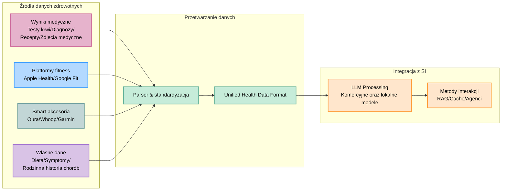

# 🚀 **OpenHealth**

<div align="center">

**Asystent medyczny oparty na SI | Oparty na Twoich danych, działający lokalnie**

<p align="center">
  
  
  
</p>

### 🌍 Wybierz swój język
[polski](i18n/readme/README.pl.md) | [English](README.md) | [Français](i18n/readme/README.fr.md) | [Deutsch](i18n/readme/README.de.md) | [Español](i18n/readme/README.es.md) | [한국어](i18n/readme/README.ko.md) | [中文](i18n/readme/README.zh.md) | [日本語](i18n/readme/README.ja.md)

</div>

---

<p align="center">
  
</p>

## 🌟 Opis

> OpenHealth pomaga Ci **opanować Twoje dane medyczne**. Wykorzystując SI i informacje o Twoim stanie zdrowia,
> OpenHealth służy za prywatnego i uruchomionego lokalnie asystenta, który pomaga Ci zrozumieć i zarządzać swoim zdrowiem.

## ✨ Funkcje

<details open>
<summary><b>Główne funkcje</b></summary>

- 📊 **Centralizacja:** Połącz wszystkie swoje dane w jednym miejscu w przystępny sposób.
- 🛠️ **Analiza:** Automatycznie analizuje Twoje dane medyczne, konwertując je do ustrukuryzowanych plików.
- 🤝 **Konwersacje:** Użyj ustrukturyzowanych danych jako kontekst w swoich interakcjach z asystentem SI opartym na GPT.

</details>

## 📥 Wspierane źródła danych i modele językowe

<table>
  <tr>
    <th>Źródła, które możesz dodać</th>
    <th>Wspierane modele językowe</th>
  </tr>
  <tr>
    <td>
      • Wyniki badań krwi<br>
      • Dane kontroli medycznych<br>
      • Informacje o zdrowiu fizycznym<br>
      • Rodzinna historia chorób<br>
      • Symptomy
    </td>
    <td>
      • LLaMA<br>
      • DeepSeek-V3<br>
      • GPT<br>
      • Claude<br>
      • Gemini
    </td>
  </tr>
</table>

## 🤔 Dlaczego zbudowaliśmy OpenHealth?

> - 💡 **Twoje zdrowie jest Twoją odpowiedzialnością.**
> - ✅ Poprawne zarządzanie zdrowiem łączy **twoje dane** + **wiedzę**, zmieniając spostrzeżenia na skuteczne plany.
> - 🧠 SI służy za bezstronne narzędzie, które pokieruje Cię oraz wesprze w długoterminowym zarządzaniu swoim zdrowiem.

## 🗺️ Diagram projektu



> **Note:** The data parsing functionality is currently implemented in a separate Python server and is planned to be migrated to TypeScript in the future.

## Getting Started

## ⚙️ How to Run OpenHealth

<details open>
<summary><b>Installation Instructions</b></summary>

1. **Clone the Repository:**
   ```bash
   git clone https://github.com/OpenHealthForAll/open-health.git
   cd open-health
   ```

2. **Setup and Run:**
   ```bash
   # Copy environment file
   cp .env.example .env

   # Add API keys to .env file:
   # UPSTAGE_API_KEY - For parsing (You can get $10 credit without card registration by signing up at https://www.upstage.ai)
   # OPENAI_API_KEY - For enhanced parsing capabilities

   # Start the application using Docker Compose
   docker compose --env-file .env up
   ```

   For existing users, use:
   ```bash
   docker compose --env-file .env up --build
   ```

3. **Access OpenHealth:**
   Open your browser and navigate to `http://localhost:3000` to begin using OpenHealth.

> **Note:** The system consists of two main components: parsing and LLM. Currently, parsing utilizes Upstage and OpenAI APIs (which showed the best performance in our testing) with a local parser coming soon, while the LLM component can run fully locally using Ollama.

> **Note:** If you're using Ollama with Docker, make sure to set the Ollama API endpoint to: `http://docker.for.mac.localhost:11434/`

</details>

---

## Star History

[](https://star-history.com/#OpenHealthForAll/open-health&Date)

---

## 🌐 Community and Support

<div align="center">

### 💫 Share Your Story & Get Updated & Give Feedback
[](https://www.reddit.com/r/AIDoctor/)

### 📬 Contact
[](https://www.reddit.com/user/Dry_Steak30/)

</div>
